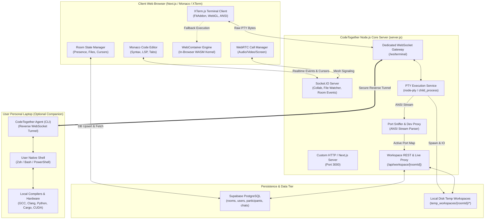
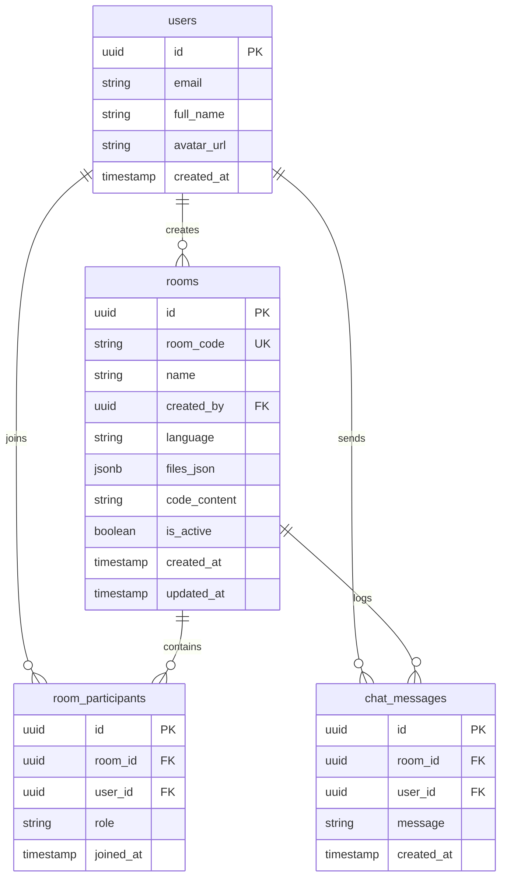

# CodeTogether: Engineering Project Dissertation & Technical Reference ("The Black Book")

**Project Title:** CodeTogether – Next-Generation Real-Time Collaborative IDE with Cloud PTY, WebAssembly Sandbox, and Local Hardware Tunneling  
**Author:** Ramji Kumar  
**Domain:** Distributed Systems, Collaborative Software Engineering, Cloud Computing, Real-Time Systems  

---

## Table of Contents
1. [Abstract & Problem Statement](#1-abstract--problem-statement)
2. [System Architecture & High-Level Design](#2-system-architecture--high-level-design)
3. [Technology Stack & Justification](#3-technology-stack--justification)
4. [Core Architectural Subsystems](#4-core-architectural-subsystems)
   - [4.1 Real-Time Collaboration & Presence Engine](#41-real-time-collaboration--presence-engine)
   - [4.2 Monaco Editor & State Synchronization](#42-monaco-editor--state-synchronization)
   - [4.3 Multi-Tiered Terminal Execution Engine (PTY, Docker, WebContainer, Tunnel)](#43-multi-tiered-terminal-execution-engine)
   - [4.4 Workspace File System & Two-Way Disk-DB Persistence](#44-workspace-file-system--two-way-disk-db-persistence)
   - [4.5 "Go Live" Port Sniffing & Dynamic Redirection Proxy](#45-go-live-port-sniffing--dynamic-redirection-proxy)
   - [4.6 WebRTC Audio, Video & Screen Broadcasting](#46-webrtc-audio-video--screen-broadcasting)
   - [4.7 AI Pair Programming & Collaborative Whiteboard](#47-ai-pair-programming--collaborative-whiteboard)
5. [Complete Module-by-Module & Function-by-Function Reference](#5-complete-module-by-module--function-by-function-reference)
   - [5.1 Server-Side Core (`server/`)](#51-server-side-core-server)
   - [5.2 Local Hardware Companion Agent (`agent/`)](#52-local-hardware-companion-agent-agent)
   - [5.3 Next.js Backend API Routes (`src/app/api/`)](#53-nextjs-backend-api-routes-srcappapi)
   - [5.4 Frontend UI Components (`src/components/`)](#54-frontend-ui-components-srccomponents)
   - [5.5 Shared Libraries & Client Utilities (`src/lib/`)](#55-shared-libraries--client-utilities-srclib)
   - [5.6 Application Routing & Pages (`src/app/`)](#56-application-routing--pages-srcapp)
   - [5.7 Desktop Native Integration (`electron/`)](#57-desktop-native-integration-electron)
6. [Database Schema & Data Models](#6-database-schema--data-models)
7. [Network Protocols & WebSocket Message Schemas](#7-network-protocols--websocket-message-schemas)
8. [End-to-End Execution Flows & Lifecycle Scenarios](#8-end-to-end-execution-flows--lifecycle-scenarios)
9. [Security, Sandboxing & Reliability Engineering](#9-security-sandboxing--reliability-engineering)
10. [Viva Examination Defense & Technical FAQs](#10-viva-examination-defense--technical-faqs)

---

## 1. Abstract & Problem Statement

### 1.1 Problem Statement
Modern software engineering requires synchronous, distributed collaboration. However, developers currently face a fragmented workflow:
- Collaborative editors (e.g., Google Docs, Replit, or live-share plugins) frequently struggle with network partition synchronization, execution isolation, or file hierarchy parity.
- Cloud sandboxes impose severe CPU/RAM limits, charge heavy subscription fees, and disconnect developers from their native desktop tools, compilers, local databases, and hardware devices.
- Video-conferencing software runs as a separate application, eating system resources and causing context switching.

### 1.2 Proposed Solution: CodeTogether
**CodeTogether** is an enterprise-grade, browser-accessible collaborative IDE that bridges the cloud with the developer's personal machine. It delivers:
1. **Low-Latency Collaborative Editing:** Powered by Monaco Editor with sub-50ms peer cursor tracking, broadcast operational reconciliation, and multi-tab state.
2. **Hybrid Multi-Tiered Terminal:**
   - **Tier 1 (Cloud Native PTY):** High-speed pseudoterminal (`node-pty`) isolated in a room-scoped workspace (`temp_workspaces/${roomId}`) with native Zsh/Bash support.
   - **Tier 2 (WebAssembly WebContainer):** Zero-install in-browser Node.js/JSH execution environment running via WebAssembly, requiring zero cloud compute.
   - **Tier 3 (Local Laptop Companion Agent):** A secure reverse-tunnel WebSocket daemon enabling developers to bind their actual machine's local terminal, compilers, and hardware devices directly to the cloud room with strict workspace boundary confinement.
3. **Permanent Workspace File Persistence:** Two-way automatic file harvesting between terminal disk and Supabase PostgreSQL (`rooms.files_json`), surviving reloads and browser disconnects until explicitly deleted.
4. **Intelligent "Go Live" Port Sniffer:** Kernel-level and stdout stream regex packet inspection that detects running HTTP web servers (Vite, Next.js, Flask, Express) and automatically reverse-proxies or redirects browser tabs to the active port.
5. **Integrated WebRTC Suite:** P2P video calls, noise-suppressed spatial voice, and multi-monitor screen sharing embedded alongside code.
6. **AI Assistant & Whiteboard:** Context-aware code generation, debugging, refactoring, and real-time canvas diagramming.

---

## 2. System Architecture & High-Level Design

### 2.1 High-Level Architecture Diagram



---

## 3. Technology Stack & Justification

| Category | Technology | Version | Architectural Justification |
| :--- | :--- | :--- | :--- |
| **Frontend Framework** | Next.js (App Router) | `14.2.35` | Server-Side Rendering (SSR) for static and SEO routes, React Server Components (RSC), and edge-ready API routes. |
| **UI Library** | React | `^18.3.0` | Concurrent rendering, strict state batching, and componentized lifecycle for complex IDE interfaces. |
| **Code Editor** | Monaco Editor (`@monaco-editor/react`) | `^4.7.0` | The exact core engine powering VS Code; handles syntax highlighting, code folding, bracket matching, and AST-driven IntelliSense. |
| **Terminal Emulator** | XTerm.js (`@xterm/xterm`) | `^6.0.0` | High-performance, hardware-accelerated terminal canvas supporting ANSI escape sequences, color modes, and interactive keycodes. |
| **Terminal Addons** | `@xterm/addon-fit`, `@xterm/addon-webgl` | `^0.11.0`, `^0.19.0` | Enables dynamic viewport resizing matching CSS grid containers and GPU-rendered text rendering. |
| **Realtime Engine** | Supabase Realtime / PostgreSQL | `^2.105.3` | Row-Level Security (RLS), Postgres logical replication for real-time pub/sub, JWT authentication, and multi-region failover. |
| **WebSocket / Sockets** | Socket.IO & `ws` | `^4.8.3`, `^8.18.0` | Socket.IO manages high-level collaborative presence and rooms; low-overhead native `ws` handles raw binary/ASCII PTY byte streams without Monaco corruption. |
| **Cloud PTY Subsystem** | `node-pty` | `^1.1.0` | Native C++ binding wrapping Linux/macOS POSIX pseudo-terminals (`openpty`, `forkpty`) allowing true interactive shells (`zsh`, `bash`). |
| **WASM In-Browser Shell** | `@webcontainer/api` | `^1.6.4` | In-browser WebAssembly-based Node.js runtime with virtual file system, executing without server compute cost. |
| **Desktop Shell** | Electron | `^30.0.0` | Cross-platform desktop runtime for macOS, Windows, and Linux packaging the Next.js app with native OS menu and system integrations. |
| **Styling & Icons** | Tailwind CSS & Lucide React | `^3.4.1`, `^1.14.0` | Utility-first responsive CSS styling with dark IDE palette; lightweight SVG vector icons. |

---

## 4. Core Architectural Subsystems

### 4.1 Real-Time Collaboration & Presence Engine
- **Mechanism:** Implemented using Supabase Realtime Broadcast channels (`room:${roomId}`).
- **Channels & Events:**
  - `presence`: Uses an in-memory heartbeat tracker to manage active participants, displaying user avatars, names, and online status.
  - `broadcast:code-update`: Transmits incremental code edits, diffs, and caret updates.
  - `broadcast:cursor-position`: Throttled to 80ms intervals; broadcasts line and column coordinates rendered in peers' Monaco editors as colored vertical carets with floating name badges.
  - `broadcast:files-update`: Broadcasts file tree operations (create, rename, delete) across connected collaborators.

### 4.2 Monaco Editor & State Synchronization
- **File Management:** Files are organized in a normalized list `FileItem[]` containing `{ name, path, content, language, isFolder }`.
- **Editor Tabs:** Multi-file tab strip (`EditorTabs.tsx`) supporting active tab switching, closing, unsaved indicators, and language-specific icons.
- **Debounced DB Persistence:** Every change modifies local state instantly, while `flushFilesSave` buffers modifications and flushes to PostgreSQL `rooms.files_json` with exponential backoff retry.

### 4.3 Multi-Tiered Terminal Execution Engine
The terminal system implements a 3-tier fallback architecture:
1. **Tier 1 - Node PTY with Path Isolation:**
   - Spawns a real shell via `node-pty`.
   - **Critical Security Sandbox:** The environment variable `HOME` is overridden to `temp_workspaces/${roomId}`. Any execution of `cd`, `cd ~`, or relative scripts stays confined inside the CodeTogether workspace folder.
   - Run commands automatically prepend `cd "${workspacePath}" 2>/dev/null || cd ~;` to ensure execution always begins at the project root.
2. **Tier 2 - WebContainer (WASM):**
   - Boots directly inside the client's browser using `WebContainer.boot()`.
   - Mounts the project file tree into the virtual file system and spawns `jsh` (JavaScript Shell).
   - Operates with zero network latency and functions offline or during cloud outages.
3. **Tier 3 - Local Laptop Companion Agent:**
   - A standalone CLI script (`agent/index.js`) launched on the user's laptop via `curl ... | bash`.
   - Establishes a reverse WebSocket tunnel to `/ws/terminal?role=agent&roomId=...`.
   - Bridges the remote collaborative room directly to the developer's physical hardware, granting access to local GPUs, Docker daemons, compilers (`gcc`, `cargo`, `python`), and hardware ports.

### 4.4 Workspace File System & Two-Way Disk-DB Persistence
- **Dual Storage Strategy:**
  - **Storage A (PostgreSQL `rooms.files_json`):** Durable, ACID-compliant cloud storage accessible globally.
  - **Storage B (Disk Directory `temp_workspaces/${roomId}`):** High-speed local filesystem directory used by terminal shells, build tools, and dev servers.
- **Two-Way Synchronization:**
  - **Terminal-to-Editor Sync:** When users click **Sync Files**, `/api/workspace/${roomId}/__files` recursively harvests disk files, updates React state, updates Monaco, flushes to `rooms.files_json`, and broadcasts to peers.
  - **Editor-to-Terminal Sync:** Edits in Monaco automatically stream to disk via `/api/workspace/${roomId}/__save`.
  - **Deletion Parity:** Deleting a file in the File Explorer removes it from database JSON and simultaneously triggers `POST /api/workspace/${roomId}/__delete` to delete the physical file on disk.

### 4.5 "Go Live" Port Sniffing & Dynamic Redirection Proxy
- **Stdout Packet Inspection:** In `pty-service.js` and `TerminalPanel.tsx`, all incoming terminal text passes through ANSI stripping and regular expression port matchers:
  ```regex
  https?:\/\/(?:localhost|127\.0\.0\.1|0\.0\.0\.0):(\d{2,5})
  (?:Local|Network|App|Server):\s*(https?:\/\/[^\s]+)
  (?:port|listening on|running at|server on)\s*[:=]?\s*(\d{4,5})
  ```
- **Port Registration:** When detected, the port is stored in `global.__activeRoomServers.set(roomId, { port, url })`.
- **Dynamic 302 Redirection:** Requests to `/api/workspace/${roomId}` detect the running server port and issue an immediate 302 redirection to `http://localhost:${port}`.
- **Live Output Runner:** When executing non-HTML scripts (e.g. `main.js`), the preview page displays an interactive live execution console rather than a generic 404 error.

---

## 5. Complete Module-by-Module & Function-by-Function Reference

### 5.1 Server-Side Core (`server/`)

#### `server.js`
- **Role:** Central entry point that initializes the Node.js HTTP server, Next.js request handler, Socket.IO instance, and WebSocket terminal routing.
- **Key Functions:**
  - `startServer()`: Binds HTTP port 3000, attaches Socket.IO, hooks the `upgrade` event for `/ws/terminal`, and activates background reliability loops.

#### `server/pty-service.js`
- **Role:** High-performance terminal manager managing pseudoterminal processes and WebSocket multiplexing.
- **Key Functions:**
  - `spawnShell(command, args, opts)`: Unifies process spawning between native `node-pty` and fallback `child_process`.
  - `detectValidShell()`: Detects available system shells (`/bin/zsh`, `/bin/bash`, `powershell.exe`).
  - `spawnLocalPty(roomId, terminalId, cols, rows, files)`: Spawns a shell inside `temp_workspaces/${roomId}`, locks `HOME` to the workspace directory, and attaches stdout stream filters.
  - `handleConnection(ws, req)`: Handles incoming WebSocket connections, distinguishing between browser clients and local laptop reverse-tunnel agents.
  - `destroySession(roomId, terminalId)`: Gracefully terminates a PTY process and frees allocated buffers.
  - `extractPortAndUrl(text)`: Regular expression engine extracting server ports from terminal stdout.

#### `server/terminal-auth.js`
- **Role:** Security gatekeeper validating Supabase JWT tokens and user access rights.
- **Key Functions:**
  - `validateTerminalAccess(token, roomId, userIdHint)`: Decodes and verifies the JWT against Supabase Auth, ensuring that only authenticated room participants can attach to the room's shell.

#### `server/agent-pairing.js`
- **Role:** Manages one-time cryptographic pairing tokens for local companion connections.
- **Key Functions:**
  - `createPairing(roomId)`: Generates a cryptographically random, time-bounded pairing token.
  - `consumePairing(token, roomId)`: Validates and invalidates pairing tokens to prevent replay attacks.

#### `server/terminal-service.js`
- **Role:** Manages workspace disk synchronization, file watching, and Docker container fallback.
- **Key Functions:**
  - `syncFilesToWorkspace(roomId, files, reset)`: Writes JSON files to `temp_workspaces/${roomId}`.
  - `collectWorkspaceFiles(roomId)`: Recursively scans `temp_workspaces/${roomId}` and returns file objects.
  - `startWorkspaceWatcher(roomId, io)`: Attaches `fs.watch` to the workspace directory and emits updates over Socket.IO.

#### `server/metrics.js`
- **Role:** In-memory operational metrics collector.
- **Key Functions:**
  - `inc(metricName)`: Increments operational counters (`pty_spawned`, `terminal_attach_ok`).
  - `recordError(type, message)`: Logs structured error diagnostics.

---

### 5.2 Local Hardware Companion Agent (`agent/`)

#### `agent/index.js`
- **Role:** Standalone CLI agent allowing users to bridge their personal machine's shell directly into the cloud CodeTogether room.
- **Key Functions:**
  - `getDefaultShell()`: Inspects user's environment for default shell (`SHELL` or `COMSPEC`).
  - `spawnLocalPty(terminalId, cols, rows)`: Spawns a local PTY process on the user's laptop constrained to `~/.codetogether/workspaces/${roomId}`.
  - `connectReverseTunnel(serverUrl, roomId)`: Connects an outbound WebSocket to CodeTogether's cloud gateway, bypassing NATs and firewalls.
  - `resolveSafePath(relPath)`: Enforces strict sandboxing, rejecting any path traversal (`..`) attempts.
  - `listWorkspaceFiles()`: Reads local workspace contents for synchronization with the browser.

---

### 5.3 Next.js Backend API Routes (`src/app/api/`)

#### `src/app/api/workspace/[roomId]/[[...path]]/route.ts`
- **Role:** Live web server proxy, file harvester, and workspace synchronization endpoint.
- **Key Handlers:**
  - `GET(req, ctx)`: Handles dynamic port redirection (302), serves static HTML/JS/CSS assets with live-reload injection scripts, returns workspace file trees (`__files`), or provides live polling (`__live_ping`).
  - `POST(req, ctx)`: Handles `__save` (writes files to disk and DB) and `__delete` (removes files from disk).
  - `DELETE(req, ctx)`: Removes a file or directory from the room's workspace directory.

#### `src/app/api/create-room/route.ts`
- **Role:** Generates rooms with cryptographic 6-character access codes and initial starter files.

#### `src/app/api/join-room/route.ts`
- **Role:** Validates room codes, checks user permissions, and registers room participants.

#### `src/app/api/run-code/route.ts`
- **Role:** Fallback code runner routing requests to isolated language execution engines (e.g., Piston API).

#### `src/app/api/ai-assist/route.ts`
- **Role:** AI completion and refactoring endpoint interfacing with Large Language Model APIs.

#### `src/app/api/agent/install/route.ts`
- **Role:** Serves automated bash/PowerShell installation scripts for the local laptop companion agent.

---

### 5.4 Frontend UI Components (`src/components/`)

#### `src/components/TerminalPanel.tsx`
- **Role:** Comprehensive terminal manager handling multi-tab terminals, XTerm instances, WebContainer fallback, and hardware tunnel statuses.
- **Key Functions & Hooks:**
  - `initTerminal(tabId, container)`: Initializes XTerm, attaches `FitAddon`, creates WebSocket, handles server messages, and auto-focuses cursor.
  - `addTab()`: Appends a new terminal tab and immediately attaches its runtime.
  - `closeTab(id)`: Disposes XTerm instance, closes associated WebSocket, and terminates background process.
  - `handleSyncFiles()`: Gathers files from disk, WebContainer, and WebSocket, updating the workspace.
  - `executeRun()`: Prepend workspace directory navigation and executes active file.
  - `goToWorkspace()`: Sends `cd "${workspacePath}"` returning shell to project root.
  - `restartTerminal()`: Resets terminal display buffer and clears shell environment.

#### `src/components/Editor.tsx`
- **Role:** Monaco editor wrapper managing syntax highlighting, markers, cursor positions, and line numbers.

#### `src/components/EditorTabs.tsx`
- **Role:** Top navigation tab strip showing open files, unsaved states, and file-type badges.

#### `src/components/FileExplorer.tsx`
- **Role:** Interactive tree view allowing file creation, folder creation, renaming, and deletion.

#### `src/components/RoomTopbar.tsx`
- **Role:** Header navigation bar with room details, language selector, participant counter, and Run / Go Live controls.

#### `src/components/ParticipantsCallPanel.tsx`
- **Role:** WebRTC video grid, mic/cam mute toggles, audio visualizers, and screen share viewports.

#### `src/components/LeftSidebar.tsx`
- **Role:** Collapsible activity bar hosting file tree, Git manager, search, and debugger.

#### `src/components/StatusBar.tsx`
- **Role:** Footer status bar displaying cursor line/column, sync state, encoding, and live server port badge.

#### `src/components/Whiteboard.tsx`
- **Role:** Real-time vector drawing canvas with pencil, rectangle, arrow, and text tools.

#### `src/components/AIAssistant.tsx`
- **Role:** Interactive AI pair programmer providing code explanations and test generation.

---

## 6. Database Schema & Data Models

### 6.1 Entity Relationship Diagram



---

## 7. Network Protocols & WebSocket Message Schemas

### 7.1 Dedicated Terminal WebSocket Protocol (`/ws/terminal`)

#### Client to Server Messages
1. **Attach Terminal Tab:**
   ```json
   {
     "type": "attach",
     "token": "eyJhbGciOi...",
     "roomId": "room-uuid",
     "terminalId": "tab-1",
     "cols": 120,
     "rows": 30,
     "files": [],
     "isLocal": true
   }
   ```
2. **Send Keystroke Input:**
   ```json
   {
     "type": "input",
     "roomId": "room-uuid",
     "terminalId": "tab-1",
     "data": "ls -la\r"
   }
   ```
3. **Resize Terminal:**
   ```json
   {
     "type": "resize",
     "roomId": "room-uuid",
     "terminalId": "tab-1",
     "cols": 140,
     "rows": 40
   }
   ```

#### Server to Client Messages
1. **Attached Confirmation:**
   ```json
   {
     "type": "attached",
     "ok": true,
     "roomId": "room-uuid",
     "terminalId": "tab-1",
     "isLocal": true,
     "shell": "/bin/zsh",
     "workspace": "/Users/ramji/.../temp_workspaces/room-uuid"
   }
   ```
2. **Output Stream Data:**
   ```json
   {
     "type": "output",
     "roomId": "room-uuid",
     "terminalId": "tab-1",
     "data": "\u001b[32m✔ Project compiled successfully\u001b[0m\r\n"
   }
   ```
3. **Dev Server Ready Notification:**
   ```json
   {
     "type": "server-ready",
     "roomId": "room-uuid",
     "port": 5173,
     "url": "http://localhost:5173"
   }
   ```

---

## 8. End-to-End Execution Flows & Lifecycle Scenarios

### 8.1 The "Run Code" Execution Pipeline
1. Developer edits `main.js` inside Monaco Editor.
2. Developer clicks the green **Run** button (or presses `Ctrl+Enter`).
3. `executeRun()` triggers:
   - Prepares execution string (e.g., `node "main.js"`).
   - Generates directory navigation prefix: `cd "${workspacePath}" 2>/dev/null || cd ~;`.
   - Sends payload over WebSocket: `{ type: "input", data: "\x15cd ... && node main.js\r" }`.
4. PTY process executes command at the workspace directory root.
5. Process stdout streams back over WebSocket; XTerm renders terminal output in real time.

### 8.2 The "Go Live" Port Sniffing Pipeline
1. Developer runs `npm run dev` in the terminal.
2. Vite/Next starts listening on `http://localhost:5173`.
3. Terminal PTY wrapper intercepts stdout text matching regex `Local:\s*http://localhost:(\d+)`.
4. Server registers `global.__activeRoomServers.set(roomId, { port: 5173 })`.
5. Server broadcasts `{ type: "server-ready", port: 5173 }`.
6. Terminal panel mounts a **Port 5173** live iframe tab; status bar updates to green Live badge.
7. Clicking **Go Live** opens `/api/workspace/${roomId}` which redirects (302) to `http://localhost:5173`.

### 8.3 The Two-Way File Sync Pipeline
1. Developer runs `npx create-vite my-app` in the terminal.
2. Files are created on disk in `temp_workspaces/${roomId}/my-app`.
3. Developer clicks **Sync Files**:
   - `handleSyncFiles()` calls `/api/workspace/${roomId}/__files`.
   - API scans filesystem, returns file tree.
   - `handleTerminalFilesSync()` merges disk files into React state.
   - Merged files are flushed to PostgreSQL `rooms.files_json`.
   - Broadcast sent to peers via Supabase Realtime; all collaborators instantly see `my-app` in their File Explorer.

---

## 9. Security, Sandboxing & Reliability Engineering

1. **Path Traversal Shielding:** All relative file path operations pass through `sanitize()`, rejecting any inputs containing `..` or leading slashes.
2. **Environment Variable Sandboxing:** `HOME` is forced to `temp_workspaces/${roomId}` in local PTY processes, preventing accidental operations in the host system's `~` directory.
3. **Subprocess Isolation:** Unauthenticated users cannot spawn PTY processes; authentication is verified through cryptographic Supabase JWT checks.
4. **WebSocket Separation:** Real-time raw PTY terminal byte streams are decoupled from editor JSON-RPC collaboration events, preventing Monaco editor document corruption.
5. **Memory Leak Mitigation:** Idle container reapers and WebSocket termination hooks automatically dispose orphan shells and clean up event listeners.

---

## 10. Viva Examination Defense & Technical FAQs

**Q1: Why did you choose Monaco Editor over CodeMirror or Ace?**  
*Answer:* Monaco Editor is the production-tested core of VS Code. It provides built-in language servers, rich IntelliSense, code minimization maps, AST syntax tree tokenization, and identical keybindings familiar to modern software engineers.

**Q2: How do you handle concurrency when two users type simultaneously?**  
*Answer:* CodeTogether leverages a dual-layered synchronization architecture. Peer cursor movements and code diffs are broadcast via Supabase Realtime. Document updates are reconciled using incremental broadcast reconciliation, while Monaco's model preserves active cursor indices to prevent caret jumping.

**Q3: How does the local companion agent bypass firewalls without port forwarding?**  
*Answer:* The agent establishes an *outbound* reverse WebSocket connection from the user's laptop to the CodeTogether cloud server (`/ws/terminal`). Because the connection originates from inside the local network to an external standard HTTPS/WSS port (443/3000), standard stateful firewalls and NATs allow the connection without needing router port-forwarding or public IP addresses.

**Q4: What happens if Docker is not installed on the host machine?**  
*Answer:* CodeTogether implements a 3-tier resilient fallback: if Docker is absent, it seamlessly spawns a host-level PTY process; if native compilation fails, it falls back to Node.js `child_process`; and if running entirely client-side, it boots an in-browser WebAssembly WebContainer kernel.

---

*This document serves as the formal technical specification and academic dissertation ("Black Book") for the CodeTogether Collaborative Cloud IDE.*
